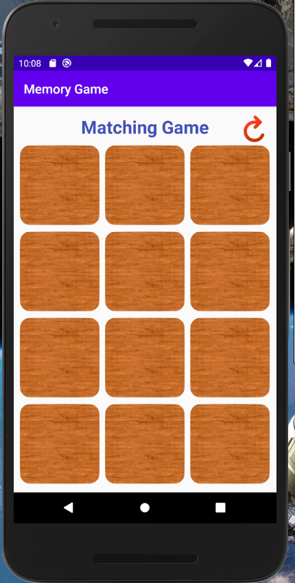
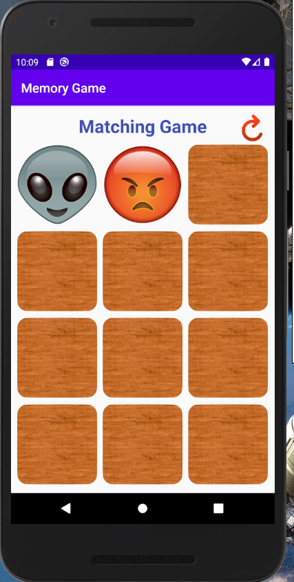
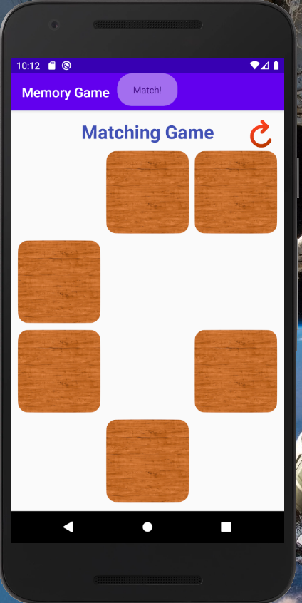
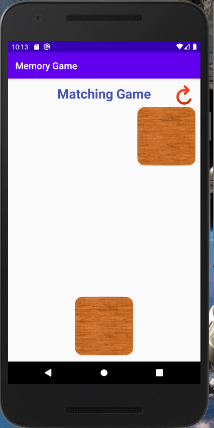
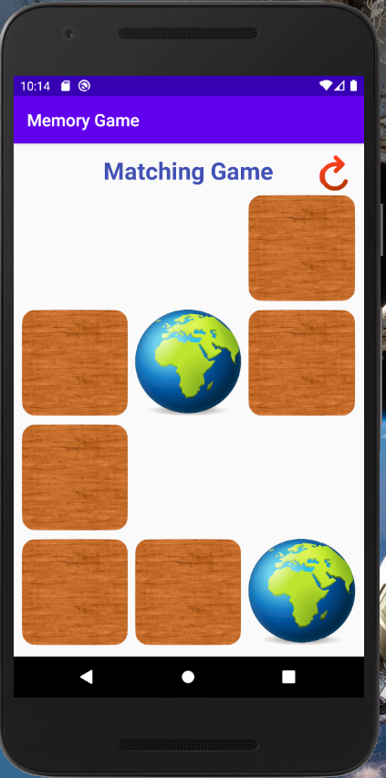

# Memory-Matching-Game
An android application that is a memory matching game built using Java.

Game Features:
- 12, face down, tiles a user can select
- A reset button to restart the game (can be used either during or after a game has finished)
- A user can select only 2 tiles at a time. Once a tile is selected it will be flipped over to reveal the front.
- If the tiles match they are removed from the board. If they do not match they will be turned back over.
- A user wins the game, once all the tiles have been removed from the board (i.e. all tiles have been matched to another identical tile)

Project Images:

